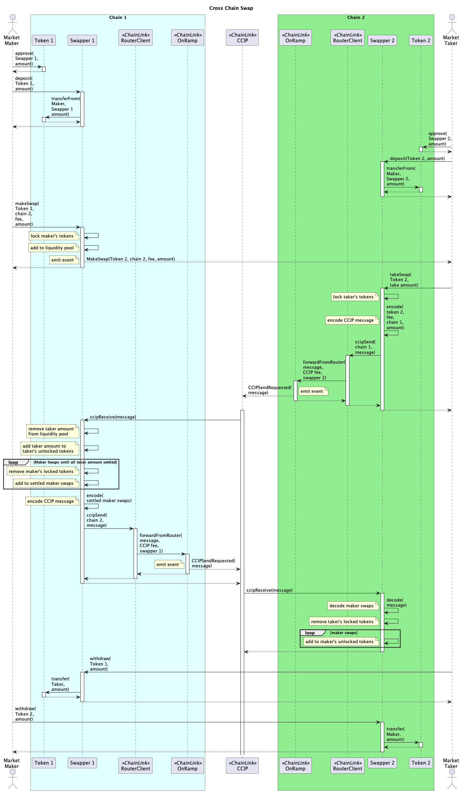

# Cross Chain Swaps

## Installation

Clone and compile this repository:

```
git clone git@github.com:dimsome/com-bridge.git
cd packages/contracts
yarn
yarn compile
```

## Processes

Token Swap



## Chainlink Testnets

| Chain           | ChainId  | Link                                       | CCIP Router                                |
| --------------- | -------- | ------------------------------------------ | ------------------------------------------ |
| Avalanche Fuji  | 43113    | 0x0b9d5D9136855f6FEc3c0993feE6E9CE8a297846 | 0x554472a2720e5e7d5d3c817529aba05eed5f82d8 |
| Sepolia         | 11155111 | 0x779877A7B0D9E8603169DdbD7836e478b4624789 | 0xd0daae2231e9cb96b94c8512223533293c3693bf |
| Optimism Goerli | 420      | 0xdc2CC710e42857672E7907CF474a69B63B93089f | 0xeb52e9ae4a9fb37172978642d4c141ef53876f26 |
| Arbitrum Goerli | 421613   | 0xd14838A68E8AFBAdE5efb411d5871ea0011AFd28 | 0x88E492127709447A5ABEFdaB8788a15B4567589E |
| Polygon Mumbai  | 80001    | 0x326C977E6efc84E512bB9C30f76E30c160eD06FB | 0x70499c328e1e2a3c41108bd3730f6670a44595d1 |
| BNB Testnet     | 97       | 0x84b9B910527Ad5C03A9Ca831909E21e236EA7b06 | 0x9527e2d01a3064ef6b50c1da1c0cc523803bcff2 |
| Base Testnet    | 84531    | 0xd886e2286fd1073df82462ea1822119600af80b6 | 0xa8c0c11bf64af62cdca6f93d3769b88bdd7cb93d |

# Contract Deployments

| Chain         | Meow Token                                                                                                                    | Cross Chain Swapper |
| ------------- | ----------------------------------------------------------------------------------------------------------------------------- | ------------------- |
| Sepolia       | [0x4a3C098D5D1422574015A55d7ad9Cf904226a2e6](https://sepolia.etherscan.io/address/0x4a3C098D5D1422574015A55d7ad9Cf904226a2e6) |                     |
| Avalance Fuji | [0x2237e5dee801a432965210933c1F26696565303d](https://testnet.snowtrace.io/address/0x2237e5dee801a432965210933c1F26696565303d) |                     |

```sh
export PRIVATE_KEY=

# Meow token on Sepolia
yarn task token-deploy --name meow --symbol meow --decimals 18  --network sepolia
yarn task ccs-deploy --network sepolia
# Approve the CrossChainSwapper to transfer Meow tokens
yarn task token-approve --token Meow --spender 0x1E556E893C4CDB189E6AAA27834e8B3d04Dc02c7 --network sepolia
# Deposit Meow tokens into the CrossChainSwapper
yarn task ccs-deposit --amount 10 --token Meow --network sepolia

# Meow token on Avalanche Fuji
yarn task token-deploy --name meow --symbol meow --decimals 18  --network testnet
```
